<!--
  Aayan Chowhan — GitHub Profile README
  Visual system: void black / ultraviolet / electric violet / soft cyan
-->

  

<h1 align="center">Aayan Chowhan</h1>

  <strong>AI &amp; Data Science Student</strong>

  

  &nbsp;
  &nbsp;
  

## `01 // ABOUT`

AI &amp; Data Science student exploring software development, backend systems, and machine learning—turning ideas into working projects.

- Building **BackBench**, a college-scoped anonymous discussion platform
- Interested in useful software, reliable APIs, and applied AI
- Learning by shipping, breaking things, and making them better

## `02 // TOOLKIT`

  

## `03 // CURRENTLY LEARNING`

  <code>FastAPI</code>&nbsp;&nbsp;•&nbsp;&nbsp;<code>Django</code>&nbsp;&nbsp;•&nbsp;&nbsp;<code>REST API Design</code>&nbsp;&nbsp;•&nbsp;&nbsp;<code>PostgreSQL</code>&nbsp;&nbsp;•&nbsp;&nbsp;<code>Docker</code>&nbsp;&nbsp;•&nbsp;&nbsp;<code>Redis</code>&nbsp;&nbsp;•&nbsp;&nbsp;<code>System Design</code>

## `04 // SELECTED WORK`

### `01` [BackBench ↗](https://github.com/ayaanchowhan09/BackBench)

College-scoped anonymous discussion platform with a FastAPI backend, async PostgreSQL models, JWT auth, deterministic anonymous identities, and a Next.js frontend.

`Python` `FastAPI` `SQLAlchemy` `PostgreSQL` `Next.js` `TypeScript` `Docker`

### `02` [Paradise Nursery ↗](https://github.com/ayaanchowhan09/e-plantShopping)

Responsive React plant shop with categorized products, routing, and a Redux-powered cart with quantity and total management.

`React` `Redux Toolkit` `React Router` `Vite` `CSS`

### `03` [Explainable Predictive Maintenance ↗](https://github.com/ayaanchowhan09/ML-project) · *in progress*

Early-stage machine-learning project exploring explainable remaining-useful-life prediction with NASA C-MAPSS turbofan data.

`Python` `Machine Learning` `NASA C-MAPSS`

## `05 // GITHUB SIGNAL`

  
  

> The language card reflects public repository code, not overall skill level.

## `06 // CONTRIBUTION ORBIT`

  <picture>
    <source media="(prefers-color-scheme: dark)" srcset="https://raw.githubusercontent.com/ayaanchowhan09/ayaanchowhan09/output/github-contribution-grid-snake-dark.svg" />
    <source media="(prefers-color-scheme: light)" srcset="https://raw.githubusercontent.com/ayaanchowhan09/ayaanchowhan09/output/github-contribution-grid-snake.svg" />
    
  </picture>

## `07 // CONNECT`

Have an interesting project, backend problem, or applied-AI idea? Let’s talk.

  &nbsp;
  

  

